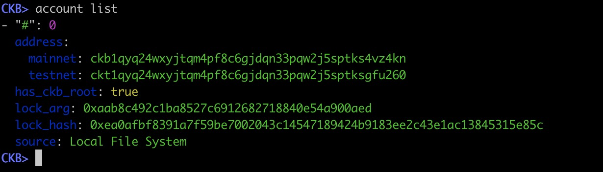
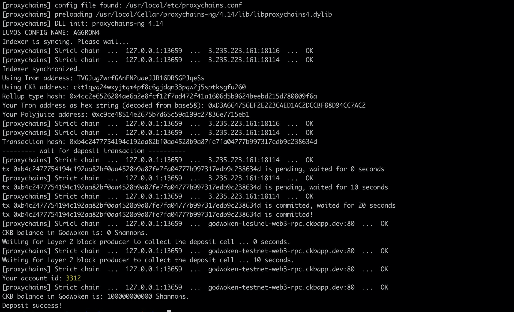
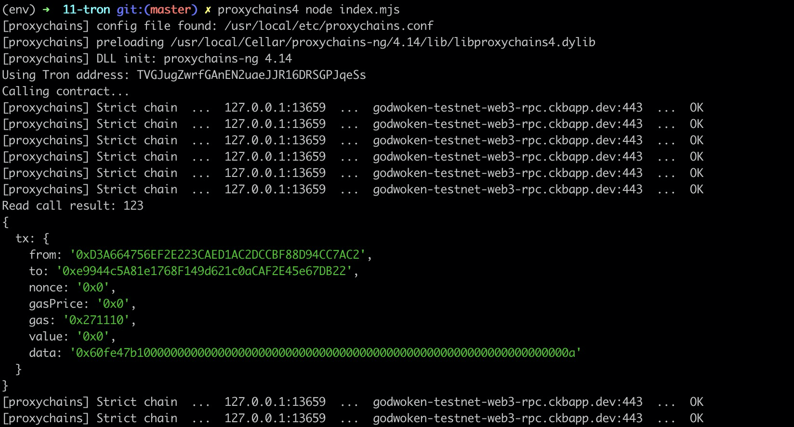

### Screenshot of accounts in ckb-cli



### Layer 1 address on the Testnet Explorer
https://explorer.nervos.org/aggron/address/ckt1qyq24wxyjtqm4pf8c6gjdqn33pqw2j5sptksgfu260

### Screenshot of deposit to L2 Tron Account

### Screenshot of smart contract calls



### Contract call transaction hash
0x85af4c1047e496cde5ca5b79ff5149d1c20c22226a9197594e502081424d4b53

### Contract address
0xe9944c5A81e1768F149d621c0aCAF2E45e67DB22

### Contract ABI
```json
[
    {
      "inputs": [],
      "stateMutability": "payable",
      "type": "constructor"
    },
    {
      "inputs": [
        {
          "internalType": "uint256",
          "name": "x",
          "type": "uint256"
        }
      ],
      "name": "set",
      "outputs": [],
      "stateMutability": "payable",
      "type": "function"
    },
    {
      "inputs": [],
      "name": "get",
      "outputs": [
        {
          "internalType": "uint256",
          "name": "",
          "type": "uint256"
        }
      ],
      "stateMutability": "view",
      "type": "function"
    }
]
```

### Tron Address
TVGJugZwrfGAnEN2uaeJJR16DRSGPJqeSs
