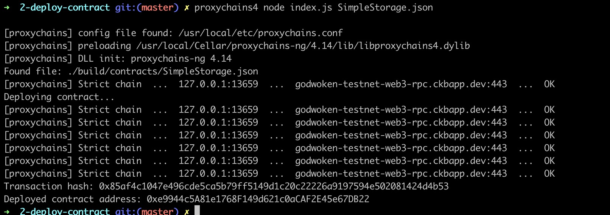

# 2. Deploy a Simple Ethereum Smart Contract on Polyjuice</h2>

## 1. A screenshot of the console output immediately after you have successfully deployed a smart contract.

## 2. The transaction hash from the contract deployment (in text format).

  <b>0x85af4c1047e496cde5ca5b79ff5149d1c20c22226a9197594e502081424d4b53</b>      
   
## 3. The deployed contract address from the contract deployment (in text format).

<b>0xe9944c5A81e1768F149d621c0aCAF2E45e67DB22</b>
