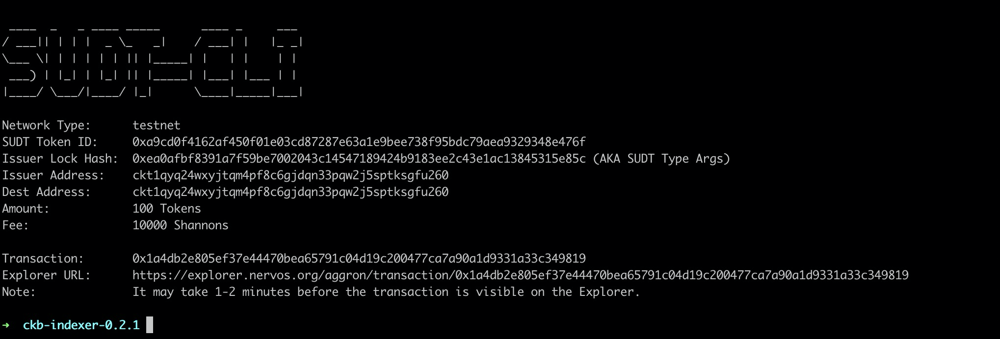
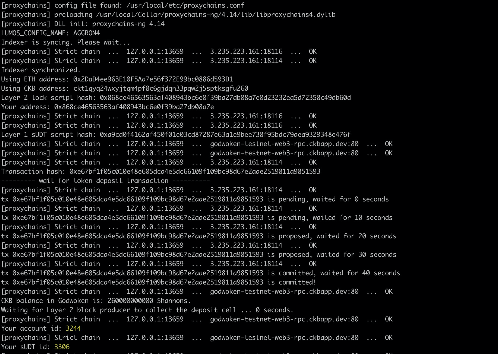

# NervosHackathon_4

## 1. A link to the Layer 1 address you funded on the Testnet Explorer.

https://explorer.nervos.org/aggron/address/ckt1qyq24wxyjtqm4pf8c6gjdqn33pqw2j5sptksgfu260

## 2. A screenshot of the console output immediately after using sudt-cli to create your SUDT tokens on Layer 1.

## 3. A link to the transaction ID created by sudt-cli on the Testnet Explorer.

 
https://explorer.nervos.org/aggron/transaction/0x1a4db2e805ef37e44470bea65791c04d19c200477ca7a90a1d9331a33c349819

## 4. A screenshot of the console output immediately after you have successfully submitted a deposit to Layer 2 using the account-cli tool.

## 5. The SUDT ID from the console output after executing the deposit script (in text format).

 <b>3306</b>   
