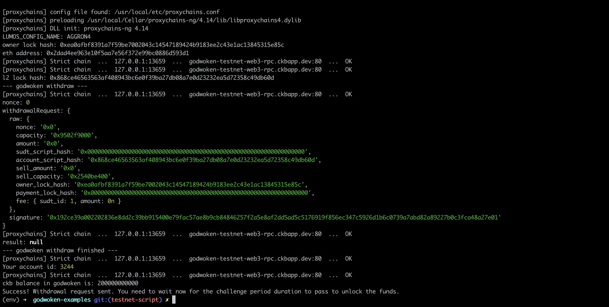

# Gitcoin: 9) Use Force Bridge to Deposit Tokens From Ethereum to Polyjuice

## 1. A screenshot of the console output immediately after running the withdraw command.

## 2. The Ethereum address that you've used for your Layer 2 account (in text format).

   <b>0x2DaD4ee963E10F5Aa7e56f372E99bc0886d593D1</b>   

## 3. The Nervos Layer 1 address that you passed to withdraw command (in text format).

  <b>ckt1qyq24wxyjtqm4pf8c6gjdqn33pqw2j5sptksgfu260</b>   
